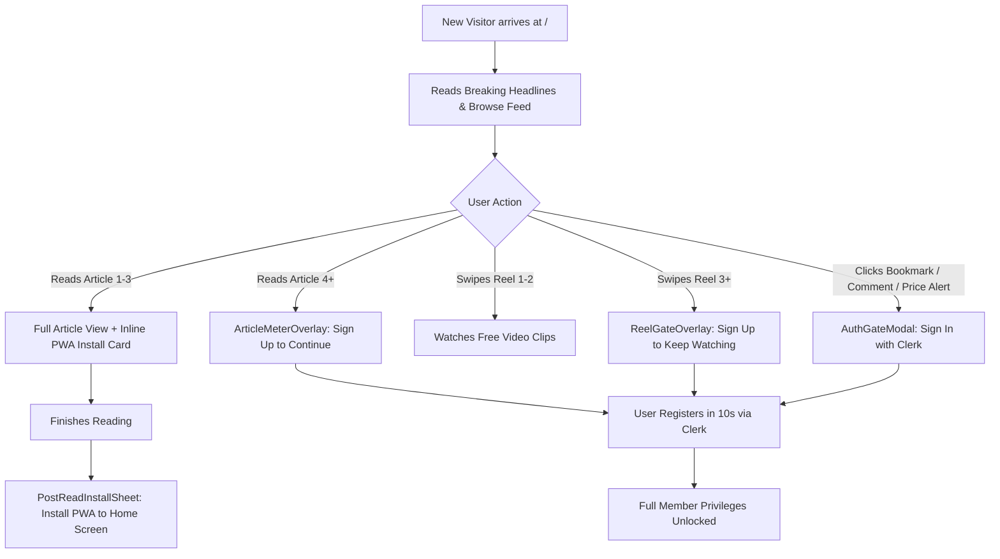

# Smart Conversion Gates & PWA Install Implementation Guide

## 1. Executive Summary

With the migration of **SLNews** to the **News-First Model** (live feed at `/`), new visitors immediately experience fresh journalism, breaking alerts, and real-time market data. 

To maximize user acquisition, we avoid two common pitfalls:
1. **The "Hard Paywall" Mistake**: Hiding everything behind a login screen on arrival. This causes >90% bounce rates because first-time visitors cannot verify whether the content is active, high-quality, or trustworthy.
2. **The "Everything Free" Mistake**: Giving away all features, video, audio, and tools with zero incentives to register or install the app.

**Smart Conversion Gates** solve this by offering an immediate hook (public headlines and previews) and presenting high-converting registration and install prompts at high-intent moments (when users try to save, comment, set price alerts, or watch video reels).

---

## 2. Which Features Should Be Locked Behind Sign-Up?

### Feature Access Matrix

| Feature / Area | Anonymous Guests | Signed-In Members Only | Gate Type |
| :--- | :---: | :---: | :--- |
| **Front Page Feed & Breaking Alerts** | ✅ Full Access | ✅ Full Access | Free Hook |
| **Article Reading** | 🟡 3 Free Articles / Week | ✅ Unlimited Reading | **Metered Registration Wall** |
| **Video Shorts & News Reels (`/reels`)** | 🟡 2-Reel Preview | ✅ Unlimited Watching | **2-Reel Consumption Gate** |
| **Reel Submissions & Citizen Journalism** | 🔒 Locked | ✅ Post & Publish Clips | **Hard Gate** (Spam Prevention) |
| **Audio Voice Reader (TTS)** | 🟡 30-sec Preview | ✅ Full Narration | **Feature Gate** |
| **Bookmarks & Saved Articles (`/saved`)** | 🔒 Locked | ✅ Cloud Sync & Offline | **Intent Gate** |
| **Personalized Topic Feed (`FollowingFeed`)** | 🔒 Locked | ✅ Custom Topic Stream | **Personalization Gate** |
| **Live Market Price Alerts** | 🔒 Locked | ✅ WhatsApp & Push Alerts | **Utility Gate** |
| **Comments & Community Discussions** | 🟡 Read Only | ✅ Post & Upvote | **Community Gate** |
| **Executive Daily Briefing (`/digest`)** | 🟡 Summary Teaser | ✅ Full AI Briefing & Archive | **Premium Content Gate** |

---

### Detailed Breakdown of Member-Only Features

#### A. Video Shorts & News Reels (`/reels`) — The 2-Reel Preview Gate
- **Why**: Video news clips and eyewitness footage are the most engaging and data-intensive assets on SLNews.
- **Implementation**:
  - Unauthenticated guests can view and swipe through the first **2 video reels**.
  - Upon swiping to the **3rd reel**, the video is paused/blurred, and a sleek frosted overlay appears:
    > 🎬 **Join SLNews to Watch Unlimited Video Reels**  
    > *Sign up for free in 10 seconds to watch unlimited eyewitness clips, like, bookmark, and share videos across Sierra Leone.*  
    > `[Sign In / Create Account]`
  - Liking reels, saving reels, and submitting eyewitness footage via `SubmitReelModal` strictly require Clerk authentication.

#### B. Metered Article Reading (Soft Registration Wall)
- **Why**: Readers who consume multiple articles in a single session have proven intent and high conversion likelihood.
- **Implementation**:
  - Track articles viewed per rolling 7-day period in `localStorage` (`slnews_articles_read`).
  - Articles 1, 2, and 3 are 100% free to read.
  - On article 4, allow paragraph 1 & 2 to render, then apply a smooth CSS gradient fade-out with an embedded prompt:
    > 📰 **You've reached your 3 free articles this week.**  
    > *Support Sierra Leone's independent digital news. Create a free account to continue reading unlimited articles.*  
    > `[Create Free Account]` `[Sign In]`

#### C. Bookmarking & Reading List (`/saved`)
- **Why**: Saving an article signifies strong personal intent to return.
- **Implementation**:
  - When an unregistered guest taps the bookmark icon on any card or article page, intercept the click.
  - Open an onboarding sheet: *"Sign in to save articles and read them offline anytime."*

#### D. Live Market Price Alerts (WhatsApp / Web Push)
- **Why**: Rice, fuel, palm oil, and foreign exchange (USD/SLE) updates are critical economic utilities.
- **Implementation**:
  - Guests can view the current prices on `/market`.
  - When a guest clicks **"Set Price Alert"** or **"Get WhatsApp Alert"**, prompt sign-up to tie the alert subscription to their verified contact info.

#### E. Comments & Community Discussions
- **Why**: Encourages civil, verified community participation while preventing spam.
- **Implementation**:
  - Guests can read all discussions.
  - The comment input displays: *"Sign in to join the conversation and share your perspective."*

---

## 3. How to Drive App Downloads (PWA Install Strategy)

Because SLNews is a Progressive Web App (PWA), users do not need Google Play or Apple App Store accounts, credit cards, or large 50MB+ downloads. In Sierra Leone, this is a massive competitive advantage.

### High-Converting Install Touchpoints

#### 1. The "Data Saver & Offline Reading" Value Proposition
- **The Angle**: In Sierra Leone, mobile data is expensive and network coverage can be spotty.
- **Placement**: Inside articles between paragraphs 3 and 4, render an inline card:
  > 📱 **Save up to 70% Mobile Data with the SLNews App**  
  > *Install SLNews to your phone's home screen in 3 seconds. Read breaking news offline even when you have no data credit.*  
  > `[Install Free App (3 MB)]`

#### 2. Post-Article Reading Sheet
- **The Angle**: The user just finished reading a high-quality article and is at peak satisfaction.
- **Trigger**: When a mobile user scrolls to the bottom of an article (past the author bio).
- **Format**: A non-intrusive bottom sheet slides up:
  > ⚡ **Never miss Sierra Leone breaking news**  
  > *Add SLNews to your home screen for instant breaking news alerts and real-time market updates.*  
  > `[Add to Home Screen]` `[Maybe Later]`

#### 3. Welcome Banner Quick Install Action
- **Placement**: In the top `WelcomeBanner` on `/`, include a direct action button:
  - `[Install App]` alongside `[Learn About SLNews]`.
  - Triggers the native browser install prompt immediately.

#### 4. Persistent Nav Options
- **Header & Mobile Drawer**: Ensure "Install App on Device" remains prominent in the mobile drawer and top app bar with clear visual badge indicators.

---

## 4. Technical Architecture & Component Design

```
src/
├── components/
│   ├── gates/
│   │   ├── AuthGateModal.tsx          # Universal modal triggered on locked actions
│   │   ├── ArticleMeterOverlay.tsx     # 3-article weekly reading limit overlay
│   │   └── ReelGateOverlay.tsx         # 2-reel preview lock for /reels
│   └── pwa/
│       ├── InArticleInstallCard.tsx    # Native-style inline data-saver install card
│       └── PostReadInstallSheet.tsx    # Slide-up install sheet upon finishing article
├── hooks/
│   ├── useArticleMeter.ts             # Tracks article view count in localStorage
│   └── usePWAInstall.ts               # Existing PWA prompt hook
```

### Flow Diagram



---

## 5. Strategic Recommendations & Rollout Plan

### Phase 1: Interaction & Utility Gating (Immediate / Zero Risk)
- Lock **Bookmarks**, **Comments**, **Reel Submissions**, and **Market Price Alerts**.
- If clicked by a guest, trigger a polished `AuthGateModal` that opens Clerk's `<SignIn />` or `<SignUp />`.
- **Impact**: Zero impact on casual browsing; 100% conversion of users attempting to use personal tools.

### Phase 2: Video Shorts 2-Reel Preview Gate (High Impact)
- Add `ReelGateOverlay` on the 3rd video in `/reels`.
- Display high-converting copy emphasizing eyewitness video journalism and local creator uploads.
- **Impact**: Drives rapid sign-ups from mobile and social media audiences who discover SLNews via video.

### Phase 3: Post-Article PWA Install Triggers
- Deploy the `InArticleInstallCard` ("Save 70% data") and `PostReadInstallSheet`.
- **Impact**: Multiplies home screen app installations, increasing daily active users (DAU) and repeat visits.

### Phase 4: Metered Reading Paywall (After Building Base Audience)
- Introduce the 3-article weekly meter once organic traffic reaches stable volume.
- Ensures search engines (Google SEO) can crawl full articles while casual readers are steadily converted into registered accounts.
